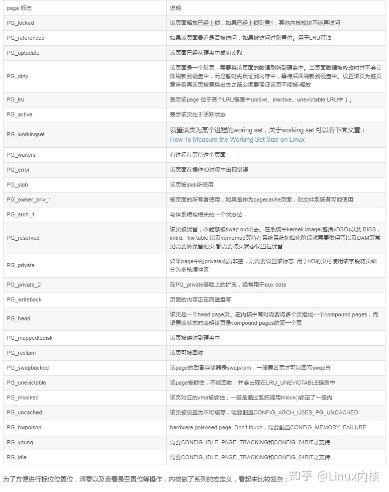

# struct_page 解读

**by 田亦海10225101529**

阅读版本为VM虚拟机内Ubunto Linux （**ubuntu-20.04.6-desktop-amd64**）

所处位置为**/usr/src/linux-hwe-5.15-headers-5.15.0-84/include/linux/mm_types.h**


## 解读


图源：[struct page数据结构的理解_struct page read only_念上的博客-CSDN博客](https://blog.csdn.net/one_piece_hui/article/details/125900851)

PS: 在第一个union内，图中缺少了struct（page_pool used by netstack）部分，可能是由于linux版本问题。不过其他都非常完美，有助于总体理解


### flags

```c
	unsigned long flags;		/* Atomic flags, some possibly
					 * updated asynchronously */
```

flags的每一个比特位存储一个状态信息，并且还划分给了section，node id，zone使用。

位于 **include\linux\page-flags.h** 下可以看到具体的含义以及一些宏



图源：[linux内核那些事之struct page - 知乎 (zhihu.com)](https://zhuanlan.zhihu.com/p/573338379)

比如

```c
#define SETPAGEFLAG(uname, lname, policy)				\
static __always_inline void SetPage##uname(struct page *page)		\
	{ set_bit(PG_##lname, &policy(page, 1)->flags); }
```


### 第一个union

包含多个结构体，并附有说明。

```c
	/*
	 * Five words (20/40 bytes) are available in this union.
	 * WARNING: bit 0 of the first word is used for PageTail(). That
	 * means the other users of this union MUST NOT use the bit to
	 * avoid collision and false-positive PageTail().
	 */
```

#### Page cache and anonymous pages

```c
		struct {	/* Page cache and anonymous pages */
			/**
			 * @lru: Pageout list, eg. active_list protected by
			 * lruvec->lru_lock.  Sometimes used as a generic list
			 * by the page owner.
			 */
			struct list_head lru;	
			/* See page-flags.h for PAGE_MAPPING_FLAGS */
			struct address_space *mapping;
			pgoff_t index;		/* Our offset within mapping. */
			/**
			 * @private: Mapping-private opaque data.
			 * Usually used for buffer_heads if PagePrivate.
			 * Used for swp_entry_t if PageSwapCache.
			 * Indicates order in the buddy system if PageBuddy.
			 */
			unsigned long private;
		};
```

**struct list_head lru**：lru 是LRU链表，根据页面不同的用途挂载到不同的链表.如在空闲时刻，被buddy系统管理时，会挂接到buffy的free 链表中

**struct address_space *mapping**：页面被映射时，指向映射的地址空间。eg：为文件映射时，mapping指向的是struct address_space *结构

**pgoff_t index**：该字段是一个复用字段。eg：当该页面被文件映射时，代表偏移量。

**unsigned long private**：私有数据指针, 由应用场景确定其具体的含义。eg: 如果设置了PG_private标志，则private字段指向struct buffer_head。


#### page_pool used by netstack

```c
		struct {	/* page_pool used by netstack */
			/**
			 * @pp_magic: magic value to avoid recycling non
			 * page_pool allocated pages.
			 */
			unsigned long pp_magic;
			struct page_pool *pp;
			unsigned long _pp_mapping_pad;
			unsigned long dma_addr;
			union {
				/**
				 * dma_addr_upper: might require a 64-bit
				 * value on 32-bit architectures.
				 */
				unsigned long dma_addr_upper;
				/**
				 * For frag page support, not supported in
				 * 32-bit architectures with 64-bit DMA.
				 */
				atomic_long_t pp_frag_count;
			};
		};
```

**unsigned long dma_addr**:如果该页被用作DMA映射，则其代表的是映射的一个总线地址

**unsigned long pp_magic**:避免回收非 `page_pool` 分配的页面

关于page_pool 可参考[Page Pool API — The Linux Kernel documentation](https://www.kernel.org/doc/html/latest/networking/page_pool.html)


#### slab, slob and slub

```c
		struct {	/* slab, slob and slub */
			union {
				struct list_head slab_list;
				struct {	/* Partial pages */
					struct page *next;
#ifdef CONFIG_64BIT
					int pages;	/* Nr of pages left */
					int pobjects;	/* Approximate count */
#else
					short int pages;
					short int pobjects;
#endif
				};
			};
			struct kmem_cache *slab_cache; /* not slob */
			/* Double-word boundary */
			void *freelist;		/* first free object */
			union {
				void *s_mem;	/* slab: first object */
				unsigned long counters;		/* SLUB */
				struct {			/* SLUB */
					unsigned inuse:16;
					unsigned objects:15;
					unsigned frozen:1;
				};
			};
		};
```

用于小内存的分配管理（省略了臃肿的其他信息）

代码中注释已经很完备了

slab：解决内存利用率低及分配效率低，访问时间长的问题

slob：slab缩小版，用于内存较小的设备

slub：slab增强版，解决了slab的一些问题。

[深入理解Linux内存管理（八）slab，slob和slub介绍 - 知乎 (zhihu.com)](https://zhuanlan.zhihu.com/p/490588193)


#### Tail pages of compound page

```c
		struct {	/* Tail pages of compound page */
			unsigned long compound_head;	/* Bit zero is set */

			/* First tail page only */
			unsigned char compound_dtor;
			unsigned char compound_order;
			atomic_t compound_mapcount;
			unsigned int compound_nr; /* 1 << compound_order */
		};
```

compound page将多个连续的物理页组装联合在一起组成一个更大页，其最大的用途是可以创建一个huge 页，具体介绍可以参考：[复合页简介(LWN.net)](https://lwn.net/Articles/619514/)

此段主要描述tail page。

**unsigned long compound_head**：指向compound pages的第一个 head页。

**unsigned char compound_dtor**：destructor，每个compound pages都保存对应的destructor

**unsigned char compound_order**：将compound pages整体页数作为order，只存在head

**atomic_t compound_mapcount:**   compound page被多少个用户进程的page 指向该页。


#### Second tail page of compound page

```c
		struct {	/* Second tail page of compound page */
			unsigned long _compound_pad_1;	/* compound_head */
			atomic_t hpage_pinned_refcount;
			/* For both global and memcg */
			struct list_head deferred_list;
		};
```

为了节省内存，定义了第二种compound tail page结构用于扩展


#### Page table pages

```c
		struct {	/* Page table pages */
			unsigned long _pt_pad_1;	/* compound_head */
			pgtable_t pmd_huge_pte; /* protected by page->ptl */
			unsigned long _pt_pad_2;	/* mapping */
			union {
				struct mm_struct *pt_mm; /* x86 pgds only */
				atomic_t pt_frag_refcount; /* powerpc */
			};
#if ALLOC_SPLIT_PTLOCKS
			spinlock_t *ptl;
#else
			spinlock_t ptl;
#endif
		};
```

page table 将一个虚拟地址按照多级划分。32位系统下支持二级或三级查找，64位下支持四级或五级查找


#### ZONE_DEVICE pages

```c
		struct {	/* ZONE_DEVICE pages */
			/** @pgmap: Points to the hosting device page map. */
			struct dev_pagemap *pgmap;
			void *zone_device_data;
			/*
			 * ZONE_DEVICE private pages are counted as being
			 * mapped so the next 3 words hold the mapping, index,
			 * and private fields from the source anonymous or
			 * page cache page while the page is migrated to device
			 * private memory.
			 * ZONE_DEVICE MEMORY_DEVICE_FS_DAX pages also
			 * use the mapping, index, and private fields when
			 * pmem backed DAX files are mapped.
			 */
		};
```

ZONE_DEVICE：为支持热插拔设备而分配的Non Volatile Memory非易失性内存（我似懂非懂）


#### rcu_head

 ```c
 		/** @rcu_head: You can use this to free a page by RCU. */
 		struct rcu_head rcu_head;
 ```

RCU锁是 Linux 内核实现的一种针对“读多写少”的共享数据的同步机制。RCU主要针对的数据对象是链表，目的是提高遍历读取数据的效率，为了达到目的使用RCU机制读取数据的时候不对链表进行耗时的加锁操作。RCU机制极大提高"链表"数据结构的读取效率 ，多个线程同时读取链表时，使用rcu_read_lock()即可，在多线程读取的同时还允许有1个线程修改链表。

[简单讲解Linux内核 RCU锁 - 知乎 (zhihu.com)](https://zhuanlan.zhihu.com/p/576714289)


### 第二个union

```c
	union {		/* This union is 4 bytes in size. */
		/*
		 * If the page can be mapped to userspace, encodes the number
		 * of times this page is referenced by a page table.
		 */
		atomic_t _mapcount;

		/*
		 * If the page is neither PageSlab nor mappable to userspace,
		 * the value stored here may help determine what this page
		 * is used for.  See page-flags.h for a list of page types
		 * which are currently stored here.
		 */
		unsigned int page_type;

		unsigned int active;		/* SLAB */
		int units;			/* SLOB */
	};

```

**atomic_t _mapcount **: 有多少个page table 映射指向该页面

**unsigned int page_type**：代表页面类型即使用用途，具体于**include\linux\page-flags.h**文件中

**unsigned int active**：表示slab中的活跃对象

**int units**：被slob使用


### _refcount

```C
	/* Usage count. *DO NOT USE DIRECTLY*. See page_ref.h */
	atomic_t _refcount;
```

用作引用计数管理，用于跟踪内存使用状况。初始化为空闲状态时计数为0，当被分配引用或被其他引用时会+1

PS: 如果该页是一个compound page，则计数会记录在head pages中


## 源码

```c
struct page {
	unsigned long flags;		/* Atomic flags, some possibly
					 * updated asynchronously */
	/*
	 * Five words (20/40 bytes) are available in this union.
	 * WARNING: bit 0 of the first word is used for PageTail(). That
	 * means the other users of this union MUST NOT use the bit to
	 * avoid collision and false-positive PageTail().
	 */
	union {
		struct {	/* Page cache and anonymous pages */
			/**
			 * @lru: Pageout list, eg. active_list protected by
			 * lruvec->lru_lock.  Sometimes used as a generic list
			 * by the page owner.
			 */
			struct list_head lru;
			/* See page-flags.h for PAGE_MAPPING_FLAGS */
			struct address_space *mapping;
			pgoff_t index;		/* Our offset within mapping. */
			/**
			 * @private: Mapping-private opaque data.
			 * Usually used for buffer_heads if PagePrivate.
			 * Used for swp_entry_t if PageSwapCache.
			 * Indicates order in the buddy system if PageBuddy.
			 */
			unsigned long private;
		};
		struct {	/* page_pool used by netstack */
			/**
			 * @pp_magic: magic value to avoid recycling non
			 * page_pool allocated pages.
			 */
			unsigned long pp_magic;
			struct page_pool *pp;
			unsigned long _pp_mapping_pad;
			unsigned long dma_addr;
			union {
				/**
				 * dma_addr_upper: might require a 64-bit
				 * value on 32-bit architectures.
				 */
				unsigned long dma_addr_upper;
				/**
				 * For frag page support, not supported in
				 * 32-bit architectures with 64-bit DMA.
				 */
				atomic_long_t pp_frag_count;
			};
		};
		struct {	/* slab, slob and slub */
			union {
				struct list_head slab_list;
				struct {	/* Partial pages */
					struct page *next;
#ifdef CONFIG_64BIT
					int pages;	/* Nr of pages left */
					int pobjects;	/* Approximate count */
#else
					short int pages;
					short int pobjects;
#endif
				};
			};
			struct kmem_cache *slab_cache; /* not slob */
			/* Double-word boundary */
			void *freelist;		/* first free object */
			union {
				void *s_mem;	/* slab: first object */
				unsigned long counters;		/* SLUB */
				struct {			/* SLUB */
					unsigned inuse:16;
					unsigned objects:15;
					unsigned frozen:1;
				};
			};
		};
		struct {	/* Tail pages of compound page */
			unsigned long compound_head;	/* Bit zero is set */

			/* First tail page only */
			unsigned char compound_dtor;
			unsigned char compound_order;
			atomic_t compound_mapcount;
			unsigned int compound_nr; /* 1 << compound_order */
		};
		struct {	/* Second tail page of compound page */
			unsigned long _compound_pad_1;	/* compound_head */
			atomic_t hpage_pinned_refcount;
			/* For both global and memcg */
			struct list_head deferred_list;
		};
		struct {	/* Page table pages */
			unsigned long _pt_pad_1;	/* compound_head */
			pgtable_t pmd_huge_pte; /* protected by page->ptl */
			unsigned long _pt_pad_2;	/* mapping */
			union {
				struct mm_struct *pt_mm; /* x86 pgds only */
				atomic_t pt_frag_refcount; /* powerpc */
			};
#if ALLOC_SPLIT_PTLOCKS
			spinlock_t *ptl;
#else
			spinlock_t ptl;
#endif
		};
		struct {	/* ZONE_DEVICE pages */
			/** @pgmap: Points to the hosting device page map. */
			struct dev_pagemap *pgmap;
			void *zone_device_data;
			/*
			 * ZONE_DEVICE private pages are counted as being
			 * mapped so the next 3 words hold the mapping, index,
			 * and private fields from the source anonymous or
			 * page cache page while the page is migrated to device
			 * private memory.
			 * ZONE_DEVICE MEMORY_DEVICE_FS_DAX pages also
			 * use the mapping, index, and private fields when
			 * pmem backed DAX files are mapped.
			 */
		};

		/** @rcu_head: You can use this to free a page by RCU. */
		struct rcu_head rcu_head;
	};

	union {		/* This union is 4 bytes in size. */
		/*
		 * If the page can be mapped to userspace, encodes the number
		 * of times this page is referenced by a page table.
		 */
		atomic_t _mapcount;

		/*
		 * If the page is neither PageSlab nor mappable to userspace,
		 * the value stored here may help determine what this page
		 * is used for.  See page-flags.h for a list of page types
		 * which are currently stored here.
		 */
		unsigned int page_type;

		unsigned int active;		/* SLAB */
		int units;			/* SLOB */
	};

	/* Usage count. *DO NOT USE DIRECTLY*. See page_ref.h */
	atomic_t _refcount;

#ifdef CONFIG_MEMCG
	unsigned long memcg_data;
#endif

	/*
	 * On machines where all RAM is mapped into kernel address space,
	 * we can simply calculate the virtual address. On machines with
	 * highmem some memory is mapped into kernel virtual memory
	 * dynamically, so we need a place to store that address.
	 * Note that this field could be 16 bits on x86 ... ;)
	 *
	 * Architectures with slow multiplication can define
	 * WANT_PAGE_VIRTUAL in asm/page.h
	 */
#if defined(WANT_PAGE_VIRTUAL)
	void *virtual;			/* Kernel virtual address (NULL if
					   not kmapped, ie. highmem) */
#endif /* WANT_PAGE_VIRTUAL */

#ifdef LAST_CPUPID_NOT_IN_PAGE_FLAGS
	int _last_cpupid;
#endif
} _struct_page_alignment;
```

