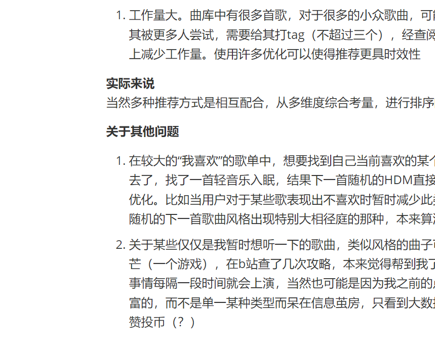

**某软件音乐推荐系统（杂谈）**
算法类大致可以分为以人为本和以物为本

**以人为本**
很好理解，已知A喜欢x、y、z三首歌；B喜欢x、y，则可以把z推荐给B。
关于定义喜欢和不喜欢，喜欢可以包括点击红心，评论，下载，收藏，分享，播放次数，完播率等
不喜欢可以包括快速切换，点击不喜欢，取消红心等
一般来说，这样推荐的方法是较为精准的，但也存在一些缺点：

1. 对于初期用户，只能先推荐一些热门歌曲作为试探，可能会导致用户找不到自己个人喜欢的曲子，导致用户流失

（解决方法有先让用户选择自己喜欢的口味）

2. 歌曲同质化，就我个人来说，听歌风味经常转变，欧美英文曲子和电音一些后摇，日文的萌系歌曲和小众音乐，不喜欢旋律比较单调的，听了一些日系女声+电音，主要听Melodic dubstep，前段时间的HDM，对了还有纯音乐。最近火起来的冯克已经听厌了。。。以及一些游戏类番剧类的曲子吧。主要的问题在于我需要不用的跟我近期不太一样的曲子，而歌曲推荐方式会正反馈导致有些同质化。所以我甚至不敢点太多的喜欢。。但是这又会导致在近期的喜欢的新类型的比例很容易升高

（之前某个时刻发现QQ音乐新增了功能，在音乐DNA中可以设置推荐的音乐熟悉度为“更探索”，对这个问题确实有一定的效果，日推的歌曲确实种类同时包括了三四类我想听的）

**以物为本**
给歌曲打tag，根据不同人喜欢的类型刻画用户画像，推荐含有其喜欢的tag的歌曲

1. 工作量大。曲库中有很多首歌，对于很多的小众歌曲，可能在人工一一打tag时有一定成本（我猜测）。对于自建的歌单，如果想要其被更多人尝试，需要给其打tag（不超过三个），经查阅确实有认为算法会综合把歌单tag提取到歌曲tag的观点，也确实会一定程度上减少工作量。使用许多优化可以使得推荐更具时效性

**实际来说**
当然多种推荐方式是相互配合，从多维度综合考量，进行排序的

**关于其他问题**
1. 在较大的“我喜欢”的歌单中，想要找到自己当前喜欢的某个类型是一件不容易的事（特别是对于懒得整理归类的我来说），比如午睡去了，找了一首轻音乐入眠，结果下一首随机的HDM直接给人干醒了（dbq我是起床铃），基于这种需要，我觉得随机算法可能需要优化。比如当用户对于某些歌表现出不喜欢时暂时减少此类tag的歌曲的出现。可能是算法已经优化了（？），最近其实不太感觉到随机的下一首歌曲风格出现特别大相径庭的那种，本来算法就是一个逐步优化的过程。

2. 关于某些仅仅是我暂时想听一下的歌曲，类似风格的曲子可能会在未来一段时间的推荐列表中频繁出现。就像前段时间玩了消逝的光芒（一个游戏），在b站查了几次攻略，本来觉得帮到我了支持一下没问题于是点赞投币了，结果给我推的越来越多了。。。类似的事情每隔一段时间就会上演，当然也可能是因为我之前的点赞太少了导致新的比重过高（？）我一直希望自己的大数据画像是多维丰富的，而不是单一某种类型而呆在信息茧房，只看到大数据想让我看到的。所以感觉个人数据面貌是很宝贵且隐私的吧，略慎重地点赞投币（？）

```c++
#include<stdio.h>
using namespace std;
int main()
{
    last
    for(int i=0;i<n;i++)
    {
        return 0;
    }
}
```


# tets!!!

# **tets!!!**





