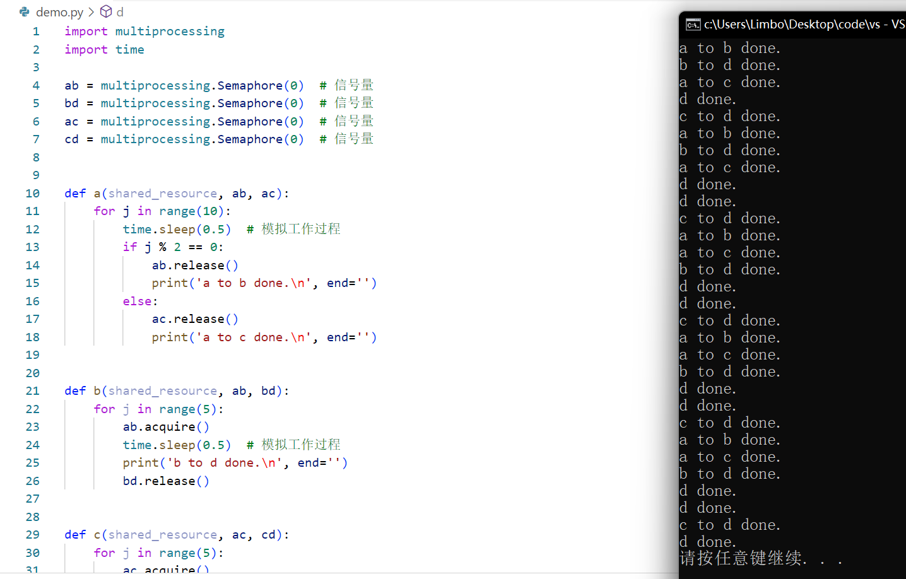
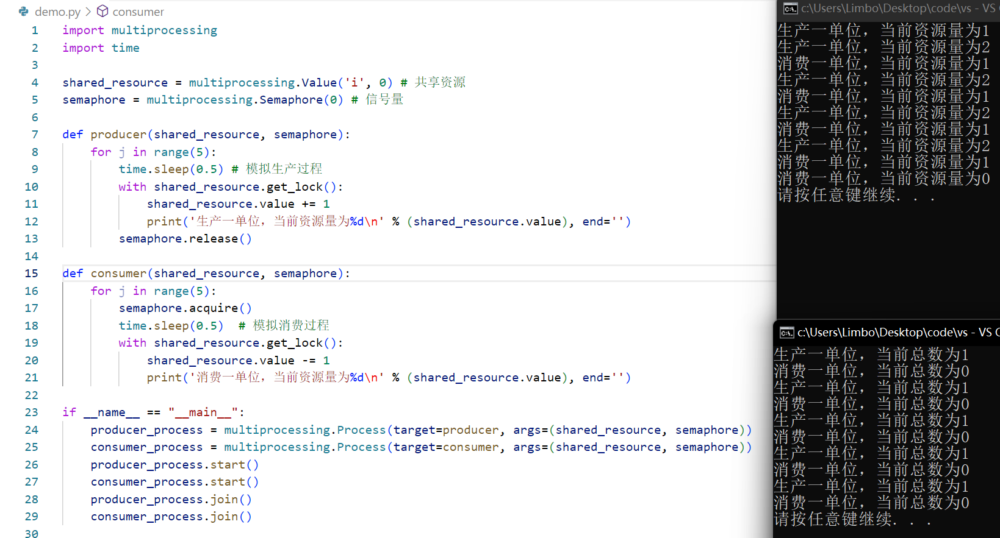

# 作业1


需要四个同步信号量。

我设置了a运行10次，b，d均运行5次，d运行10次。

代码运行的很好。




```python
import multiprocessing
import time

ab = multiprocessing.Semaphore(0)  # 信号量
bd = multiprocessing.Semaphore(0)  # 信号量
ac = multiprocessing.Semaphore(0)  # 信号量
cd = multiprocessing.Semaphore(0)  # 信号量


def a(shared_resource, ab, ac):
    for j in range(10):
        time.sleep(0.5)  # 模拟工作过程
        if j % 2 == 0:
            ab.release()
            print('a to b done.\n', end='')
        else:
            ac.release()
            print('a to c done.\n', end='')


def b(shared_resource, ab, bd):
    for j in range(5):
        ab.acquire()
        time.sleep(0.5)  # 模拟工作过程
        print('b to d done.\n', end='')
        bd.release()


def c(shared_resource, ac, cd):
    for j in range(5):
        ac.acquire()
        time.sleep(0.5)  # 模拟工作过程
        print('c to d done.\n', end='')
        cd.release()


def d(shared_resource, bd, cd):
    for j in range(10):
        while not bd.acquire(timeout=0) and not cd.acquire(timeout=0):
            # print('d is waiting...\n', end='')
            time.sleep(1)
        print('d done.\n', end='')


if __name__ == "__main__":
    a_process = multiprocessing.Process(target=a, args=(None, ab, ac))
    b_process = multiprocessing.Process(target=b, args=(None, ab, bd))
    c_process = multiprocessing.Process(target=c, args=(None, ac, cd))
    d_process = multiprocessing.Process(target=d, args=(None, bd, cd))
    a_process.start()
    b_process.start()
    c_process.start()
    d_process.start()
    a_process.join()
    b_process.join()
    c_process.join()
    d_process.join()
```


### 额外：

此外，我尝试实现了生产者->消费者的python实现，两个进程共享信号量及资源

运行结果如图：（结果不唯一）



```python
import multiprocessing
import time

shared_resource = multiprocessing.Value('i', 0) # 共享资源
semaphore = multiprocessing.Semaphore(0) # 信号量

def producer(shared_resource, semaphore):
    for j in range(5):
        time.sleep(0.5) # 模拟生产过程
        with shared_resource.get_lock():
            shared_resource.value += 1
            print('生产一单位，当前资源量为%d\n' % (shared_resource.value), end='')
        semaphore.release()

def consumer(shared_resource, semaphore):
    for j in range(5):
        semaphore.acquire()
        time.sleep(0.5)  # 模拟消费过程
        with shared_resource.get_lock():
            shared_resource.value -= 1
            print('消费一单位，当前资源量为%d\n' % (shared_resource.value), end='')

if __name__ == "__main__":
    producer_process = multiprocessing.Process(target=producer, args=(shared_resource, semaphore))
    consumer_process = multiprocessing.Process(target=consumer, args=(shared_resource, semaphore))
    producer_process.start()
    consumer_process.start()
    producer_process.join()
    consumer_process.join()
```


# 作业2

当然有别的解决方案。比如，让奇数号哲学家先拿右边的，偶数家先拿左边的。

这样，相邻的两个哲学家会优先抢夺他们之间的筷子，之后才会拿起他们之外的筷子。

```
信号量：fork[5]={1,1,1,1,1}

peo:
    think...
    if id%2==1:
        P(fork[(id+1)%5])
        P(fork[id])
    else
        P(fork[id])
        P(fork[(id+1)%5])
    eat...
    V(fork[id])
    V(fork[(id+1)%5])
```

