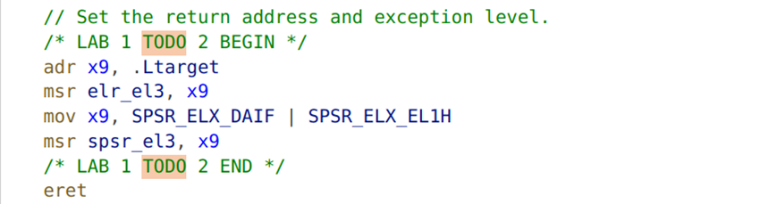

## <p align="center"> 华东师范大学计算机科学与技术学院上机实践报告</p>

| **课程名称**：操作系统  | **年级**：2022级      | **基础实验成绩**：              |
| ----------------------- | --------------------- | ------------------------------- |
| **指导教师**：石亮      | **姓名**：田亦海      | **扩展思考成绩：**              |
| **上机实践名称**：实验1 | **学号**：10225101529 | **上机实践日期**：2023年9月25日 |

***


## Ⅰ 练习题

#### Q2

在 **kernel/arch/aarch64/boot/raspi3/init/tools.S** 中 arm64_elX_to_el1 函数的 LAB 1 TODO 1 处填写一行汇编代码，获取 CPU 当前异常级别。

#### A2

查看汇编代码，发现后面根据寄存器x9的值，比较其是否为各个异常等级，继而设置为ex1.可知应该是在todo内将当前异常等级的值赋给了x9.补充代码如下：

```armasm
	/* LAB 1 TODO 1 BEGIN */
	mrs	x9, CurrentEL
	/* LAB 1 TODO 1 END */
```


#### Q3

 在 arm64_elX_to_el1 函数的 LAB 1 TODO 2 处填写大约 4 行汇编代码，设置从 EL3 跳转到 EL1 所需的 elr_el3 和 spsr_el3 寄存器值

#### A3

切换异常状态时，我们需要修改`ELR_ELn`以及`SPSR_ERn`的值。具体地，将`ELR_ELn`设置为异常跳转恢复后地目标地址，`SPSR_ERn`设置一些处理器的状态。我们需要从EL3改变到EL1，因此设置`ELR_EL3`为.Ltarget的地址(即ret指令的位置)，设置`SPSR_EL3`为`SPSR_ELX_DAIF | SPSR_ELX_EL1H`，分别对应暂时屏蔽异常事件以及改变为EL1等级。代码：

```armasm
/* LAB 1 TODO 2 BEGIN */
	adr x9, .Ltarget
	msr elr_el3, x9
	mov x9, SPSR_ELX_DAIF | SPSR_ELX_EL1H
	msr spsr_el3, x9
/* LAB 1 TODO 2 END */
```




#### Q6

在 **kernel/arch/aarch64/boot/raspi3/peripherals/uart.c** 中 LAB 1 TODO 3 处实现通过 UART 输出字符串的逻辑。 

#### A6

代码很好写，在同一个文件内部找到`uart_send`来发送单个字符的函数，然后调用即可

经查阅，UART(Universal Asynchronous Receiver/Transmitter)代表通用异步收发器，是微控制器内部的硬件外围设备，能将传入和传出的数据转换为串行二进制流，进行通信。（更具体的内容还有待了解）


#### Q7

在 kernel/arch/aarch64/boot/raspi3/init/tools.S 中 LAB 1 TODO 4 处填写一行汇编代码，以启用 MMU

#### A7


经过查阅文档，我们知道`SCTLR_EL1_M`也就是`sctlr_el1`的第0位表示MMU的启动与否,因此我们用orr指令将x8第0位置为1即可

第256行的意思是`x8=x8|1`

在后面会把`x8`赋值给`sctlr_el1`的，这样就启动MMU了。


PS：全局搜索找到文件，可以找到宏定义`SCTLR_EL1_M` 相当于`1<<0`

所以也可以填写为`orr    x8,x8,#SCTLR_EL1_M`


## Ⅱ 思考题

#### Q1

阅读 _start 函数的开头，尝试说明 ChCore 是如何让其中一个核首先进入初始化流程，并让其他核暂停执行的

#### A1

\_start函数是ChCore启动时先执行的一段代码，QEMU会先启动4个CPU核心，都执行\_start。需要让其中一个核先开始初始化。


#### Q4

结合此前 ICS 课的知识，并参考 kernel.img 的反汇编（通过 aarch64-linux-gnu-objdump -S 可获得），说明为什么要在进入 C 函数之前设置启动栈。如果不设置，会发生什么？ 

#### A4

参考此段代码：

（左侧为kernel.img的反汇编，右侧为start.S）


从汇编代码进入C函数时，设置了sp栈指针为boot_cpu_stack的最高位（很明显栈从高到低增长，所以初始为最高位）。调用C函数时，被调函数内部会把当前SP复制到FP（x29）中，并保存返回地址、调用函数的寄存器、参数等。如果不初始化启动栈，就无法利用栈保存现场以及其他数据，无法通过栈里的地址返回。


#### Q5

在实验 1 中，其实不调用 clear_bss 也不影响内核的执行，请思考不清理 .bss 段在之后的何种情况下会导致内核无法工作。


#### A5

全局变量与静态变量没有初始化或初始化值为0时，都会放在.bss段。如果不清零.bss段的话，会出现一个问题：如果我们定义了一个全局变量`int a=0;`,那么会放在.bss段，我们认为a的值已经是0了。经过使用，a的值可能会变成其他值。那么下次运行时，如果不清空.bss段，a的初始值不是0，但我们以为a的初始值已经是0了，这样可能就会出现未知的问题。

也就是说，不清理.bss段时，若上一次运行时.bss中的值被修改为非零，这次运行时可能会出现未知问题。

附上clear_bss


## Ⅲ 拓展思考题

（本次实验无拓展思考题）


## Ⅳ 总结

请在下面附上执行make grade命令的分数截图，作为实验成绩的参考。


