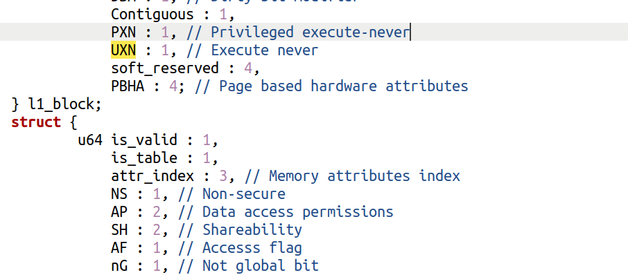
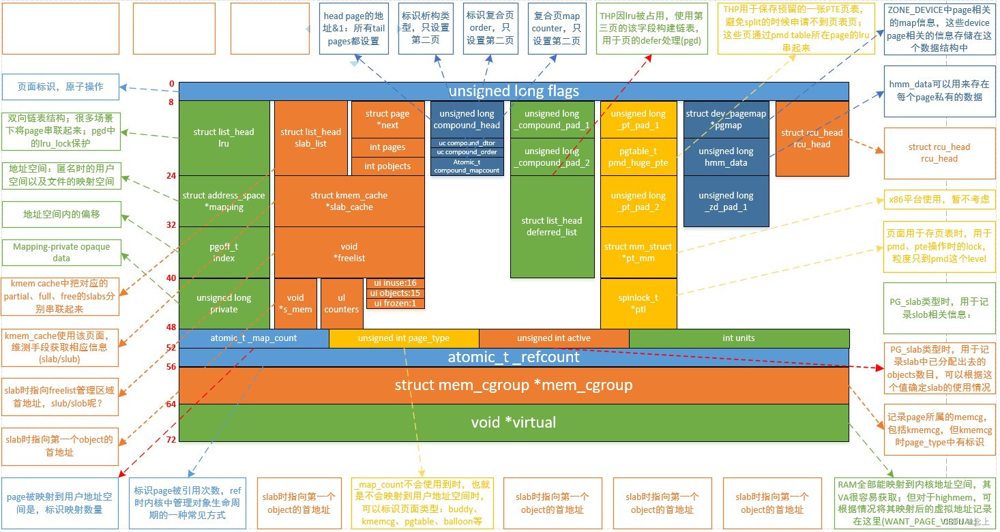

## <p align="center"> 华东师范大学计算机科学与技术学院上机实践报告</p>

| **课程名称**：操作系统           | **年级**：2022级      | **基础实验成绩**：               |
| -------------------------------- | --------------------- | -------------------------------- |
| **指导教师**：石亮               | **姓名**：田亦海      | **扩展思考成绩：**               |
| **上机实践名称**：实验2-内存管理 | **学号**：10225101529 | **上机实践日期**：2023年10月16日 |

***


## Ⅰ 练习题


#### Q1


#### A1


仿照低地址空间的内核启动页表配置，因为翻译高地址所用的寄存器为TTBR1_EL1,所以我们需要设置boot_ttbr_1_的相关信息


可以找到`KERNEL_VADDR`定义在*image.h*


根据注释，我们需要设置图片中`虚拟地址（高）`列的前两项的范围的地址。

注意ChCore使用了2M大小的块来组织内核空间的内存，是因为没有其他应用的干扰，且这样无需分配多个`4KB`的块，加快了启动速度 ; 也许还因为内核访问频率较高，用大页面减少了TLB次数。

同低地址空间的设置，因为高地址`vaddr`范围为`PHYSMEM_START + KERNEL_VADDR `到` PHYSMEM_END + KERNEL_VADDR`，因此这就是我们需要设置的范围。

此范围内`L0`，`L1`均只有一项，因此直接设置那一项就行。四个参数分别为`下一级页表头的地址`、`表示还有下级页表`、`已启用`、`非全局映射`,

（全局映射在TLB翻译时会有些用处，使得不同进程（当然虚拟空间也不同）可以使用相同的TLB项）

然后分段设置L2，类似低地址的配置。注意页表项中存储的为物理地址，因此设置为`vaddr-KERNEL_VADDR`，同样设置参数即可。


#### Q2


#### A2

首先我们观察*buddy.h*，这其中有一些定义好的结构体，`struct page`，`struct free_list`，`phys_mem_pool`：


以此入手，我们可以写出如下函数：


##### `split_page`将一个空闲的`page`划分为合适的大小:


实现思路为先从空闲列表中移除`page`,然后如果`page`的`order`(2次幂数)比需要的`order`大，那么将`page`划分为两个，将另一半`b_page`初始化信息并放入对应的空闲链表中，划分出来的左半边作为新`page`(此时`order`已经减了1，相当于大小变为一半)

直到`page`的`order`符合需要的大小，返回此`page`。


##### `buddy_get_pages()`从内存池中分配出一个大小为`order`的块：


尝试从`tmp=order`开始寻找第一个不空的大小为`tmp`的空闲链表，

观察`phys_mem_pool`中设置了大小为`BUDDY_MAX_ORDER`的空闲链表数组，实际上有效的`order`的范围为`0 ~ BUDDY_MAX_ORDER-1`

(我觉得数组大小设置为`BUDDY_MAX_ORDER+1`实际上更合理)

如果找不到则报信息并返回`NULL`

(本来我是想写`printf`输出错误信息，但是编译报错说没有引用`stdio.h`，仔细一想应该用chcore自定义的输出方式，找到了`printk`)

找到后，取此链表中的第一个块。由于`free_lists[tmp].free_list`的第一个块是一个初始化时产生的无意义的块，所以实际上我们要的是`free_lists[tmp].free_list.next`。然后由于这是一个节点，但我们想要的是包含这个节点的`page`，观察`struct_page`发现`node`是`page`的第一个元素，那么`node`的地址刚好是`page`的地址。我们做一下强制类型转换就可以。

然后我们调用函数`split_page()`将此`page`划分为合适的大小，设置为已分配，返回这个`page`即可。


##### `merge_page()`尝试将一个空闲`page`向上合并：


我们先将这个空闲块从对应的空闲链表中移除，

如果当前的`page->order`已经达到最大值`BUDDY_MAX_ORDER-1`，那么无需合并，继续下一布

否则获得`b_page`为`page`的伙伴块,如果获取不到或者伙伴块已被分配则结束合并，否则从空闲链表中删去此块，调整`page`为两个块中左边那个,将`page`的`order++`。直到无法继续合并

将最后合并的`page`放回空闲列表，并`return page`

（其实我觉得可能没必要return page）


##### `buddy_free_pages()`将一个块释放并尝试合并：


将一个块置为未分配，放入空闲链表，并尝试合并。

（很明显这里先放入空闲链表再在`merge_page ()`中移除空闲链表有一定的性能损失，也可以全部略去。但那样稍微不好理解一点，且略不同于设计函数的要求）


#### Q3


#### A3

首先我们需要理解`pte_t`以及`ptp_t`两种类型的结构体，并大致理解`get_next_ptp()`的用法


（此处仅贴出部分结构体的代码）

可以看出，`pte_t`是页表项（可同时用于L0,L1,L2,L3,是一个union）`ptp_t`是一个页表项的数组，即页框

而`get_next_ptp()`就可以根据注释看出，其作用是根据地址找到下一级的页框


看代码可知正常返回值为`NORMAL_PTP`（即0），其他情况下均为不正确的情况。

由此，我们就可以开始完成TODO：


##### `query_in_pgtbl()`尝试将虚拟地址翻译为物理地址：


由于chcore采用了四级页表，所以我们需要使用`get_next_ptp()`四次来逐级翻译寻址。

一开始，`ptp_now`应该指向`pgtbl`也就是L0页框，`idx`表示当前级数。用`ret`接`get_next_ptp()`的返回值,如果不是`NORMAL_PTP`说明发生了错误，直接返回`-ENOMAPPING`。如果成功，更新`idx`为下一级，更新`ptp_now`为当前翻译到的页框。循环执行4次。

执行4次后，应该当前的`ptp_now`就是指向那一页。检查此时所对应的`pte_now`页表项是否被标记为页且有效，如果无效返回`-ENOMAPPING`,

那么现在已经寻找到了正确的`pte`，更新`entry`为当前的`pte`,并把地址翻译，加上偏移，储存在`pa`。

(当然，翻译地址那一行也可以写为`*pa=(pte_now->l3_page.pfn<<PAGE_SHIFT)+GET_VA_OFFSET_L3(va);`，在此不再解释。)


##### `map_range_in_pgtbl() `将 [va , va + len) 映射到 [pa , pa + len）：


我们需要一页一页进行映射，因此取tmp为偏移量，每次映射`[va+tmp,va+tmp+PAGE_SIZE)`到`[pa+tmp,pa+tmp+PAGE_SIZE)`

类似上一个函数，从L0开始尝试进行映射。使用参数`alloc = true`的`get_next_ptp()`,这样如果缺少那一项就可以自动创建。

但是最后一级的项（L3->page的页表项）需要我们手动配置信息。

首先获取那一项的地址存储到`pte_now`，然后设置为`page`,设置为`valid`,设置`pfn`为`(pa+tmp)>>PAGE_SHIFT`,使用`set_pte_flags()`设置一些标识。此处观察`set_pte_flags()`的定义，可知参数3只能为`USER_PTE`。


##### `unmap_range_in_pgtbl() `将[va , va + len) 解除映射：


实现上基本完全类似于上一个函数，

一页一页清空，

尝试使用`get_next_ptp()` (参数alloc=false) 三次来找到最后一项，

如果途中发生了错误（表现为`ret != NORMAL_PTP`则无需重置），

否则，直接将此页表项清0即可


（看起来代码量不多，但Q3A3这部分可能大概花了4~5个小时，主要是debug了很久。。）


#### 附完整代码

##### A1

```c
		/* LAB 2 TODO 1 BEGIN */
        vaddr = PHYSMEM_START+KERNEL_VADDR;
        /* Step 1: set L0 and L1 page table entry */
        boot_ttbr1_l0[GET_L0_INDEX(vaddr)] = ((u64)boot_ttbr1_l1) | IS_TABLE | IS_VALID | NG;
        boot_ttbr1_l1[GET_L1_INDEX(vaddr)] = ((u64)boot_ttbr1_l2) | IS_TABLE | IS_VALID | NG;                                     
        /* Step 2: map PHYSMEM_START ~ PERIPHERAL_BASE with 2MB granularity */
		for (; vaddr < PERIPHERAL_BASE+KERNEL_VADDR; vaddr += SIZE_2M) {
                boot_ttbr1_l2[GET_L2_INDEX(vaddr)] =
                        (vaddr-KERNEL_VADDR) /* low mem, va = pa */
                        | UXN /* Unprivileged execute never */
                        | ACCESSED /* Set access flag */
                        | NG /* Mark as not global */
                        | INNER_SHARABLE /* Sharebility */
                        | NORMAL_MEMORY /* Normal memory */
                        | IS_VALID;
        }
        /* Step 2: map PERIPHERAL_BASE ~ PHYSMEM_END with 2MB granularity */
		for (vaddr = PERIPHERAL_BASE+KERNEL_VADDR; vaddr < PHYSMEM_END+KERNEL_VADDR; vaddr += SIZE_2M) {
                boot_ttbr1_l2[GET_L2_INDEX(vaddr)] =
                        (vaddr-KERNEL_VADDR) /* low mem, va = pa */
                        | UXN /* Unprivileged execute never */
                        | ACCESSED /* Set access flag */
                        | NG /* Mark as not global */
                        | DEVICE_MEMORY /* Device memory */
                        | IS_VALID;
        }
        /* LAB 2 TODO 1 END */
```


##### A2

```c
static struct page *split_page(struct phys_mem_pool *pool, u64 order, struct page *page)
{
        pool->free_lists[page->order].nr_free--;
        list_del(&(page->node));

        while(page->order>order)
        {
                page->order--;
                struct page* b_page=get_buddy_chunk(pool,page);
                if(b_page!=NULL)
                {
                        b_page->allocated=0;
                        b_page->order=page->order;

                        pool->free_lists[b_page->order].nr_free++;
                        list_append( &(b_page->node),&(pool->free_lists[b_page->order].free_list));
                }
        }
        return page;
}

struct page *buddy_get_pages(struct phys_mem_pool *pool, u64 order)
{
        int tmp=order;
        while(tmp<BUDDY_MAX_ORDER&&pool->free_lists[tmp].nr_free==0)
                tmp++;
        if(tmp>=BUDDY_MAX_ORDER)
        {
                printk("[WARNING]:Not enough memory\n");
                return NULL;
        }

        struct page* n_page=(struct page*)(pool->free_lists[tmp].free_list.next);
        split_page(pool,order,n_page);
        n_page->allocated=1;
        return n_page;
}

static struct page *merge_page(struct phys_mem_pool *pool, struct page *page)
{
        pool->free_lists[page->order].nr_free--;
        list_del(&(page->node));

        while (page->order < BUDDY_MAX_ORDER - 1) {
                struct page *b_page = get_buddy_chunk(pool, page); // buddy page
                if (b_page == NULL || b_page->allocated)
                        break;
                
                pool->free_lists[b_page->order].nr_free--;
                list_del( &(b_page->node));

                if (b_page < page) {
                        struct page *tmp = b_page;
                        b_page = page;
                        page = tmp;
                }
                page->order++;
        }
        pool->free_lists[page->order].nr_free++;
        list_append( &(page->node),&(pool->free_lists[page->order].free_list));
        return page;
}

void buddy_free_pages(struct phys_mem_pool *pool, struct page *page)
{
        page->allocated = 0;

        pool->free_lists[page->order].nr_free++;
        list_append(&(page->node),&(pool->free_lists[page->order].free_list));

        merge_page(pool, page);
}
```


##### A3

```c
int query_in_pgtbl(void *pgtbl, vaddr_t va, paddr_t *pa, pte_t **entry)
{
        int idx=0;
        ptp_t *ptp_now=(ptp_t *)pgtbl;
        ptp_t *ptp_next=NULL;
        pte_t *pte_now=NULL;
        int ret=0;
        while(idx<=3)
        {
                ret=get_next_ptp(ptp_now,idx,va,&ptp_next,&pte_now,false);
                if(ret!=NORMAL_PTP)return -ENOMAPPING;
                idx++;
                ptp_now=ptp_next;
        }
        if(!pte_now->l3_page.is_page||!pte_now->l3_page.is_valid) return -ENOMAPPING;
        *entry=pte_now;
        *pa=virt_to_phys((paddr_t)ptp_now)+GET_VA_OFFSET_L3(va);
        //*pa=(pte_now->l3_page.pfn<<PAGE_SHIFT)+GET_VA_OFFSET_L3(va);
        return 0;
}

int map_range_in_pgtbl(void *pgtbl, vaddr_t va, paddr_t pa, size_t len, vmr_prop_t flags)
{
        for(u64 tmp=0;tmp<len;tmp+=PAGE_SIZE)
        {
                ptp_t *ptp_now=(ptp_t *)pgtbl;
                ptp_t *ptp_next=NULL;
                pte_t *pte_now=NULL;
                int idx=0;
                int ret=0;
                while(idx<=2)
                {
                        ret=get_next_ptp(ptp_now,idx,va+tmp,&ptp_next,&pte_now,true);
                        idx++;
                        ptp_now=ptp_next;
                }
                pte_now=&(ptp_now->ent[GET_L3_INDEX((va+tmp))]);
                pte_now->l3_page.is_page=1;
                pte_now->l3_page.is_valid=1;
                pte_now->l3_page.pfn=(pa+tmp)>>PAGE_SHIFT;
                set_pte_flags(pte_now,flags,USER_PTE);
        }
        return 0;
}


int unmap_range_in_pgtbl(void *pgtbl, vaddr_t va, size_t len)
{
        for(u64 tmp=0;tmp<len;tmp+=PAGE_SIZE)
        {
                ptp_t *ptp_now=(ptp_t *)pgtbl;
                ptp_t *ptp_next=NULL;
                pte_t *pte_now=NULL;
                int idx=0;
                int ret=0;
                while(idx<=2)
                {
                        ret=get_next_ptp(ptp_now,idx,va+tmp,&ptp_next,&pte_now,false);
                        if(ret!=NORMAL_PTP)break;
                        idx++;
                        ptp_now=ptp_next;
                }
                if(ret==NORMAL_PTP)
                {
                        ptp_now->ent[GET_L3_INDEX((va+tmp))].pte=0;
                }
        }
        return 0;
}
```


## Ⅱ 思考题


#### Q1


#### A1

安全访问内存：页表项中有保护位，可以设置哪部分对于用户态不可用或对某个程序私有，这样就无法违规访问这段内存，保证了安全性；也可以设置只读，保护其不被改写。

按需加载：页表项中有为VPN->PPN，是页号到物理块号的映射，虚拟地址为VPN+VPO，程序使用的内存一般是连续的，从而映射到几个VPN（页号），因此可以按需加载页表项。

优势：举个例子，为了给单个程序提供4G的虚拟空间，单级页表（4KB）的话我们需要准备2^20^个页表项，若单个4B则共需要4M字节的连续空间。如果使用二级页表，我们可以先初始化2^10^的页目录表和2^10^的一级页表(共8KB)，这样可以提供4M的虚拟空间，如果进程还需要访问再加载其他一级页表就行。只要没有完全占满，那么二级页表的总消耗空间还是小于一级页表的。此外，当内存不足时还可以将不经常使用的一级页表移入磁盘，更加节省内存。

劣势：访问内存次数增加了，寻址更慢；实现更复杂


#### Q2


#### A2



结合代码及我查阅的资料，

UXN：标志为1表示该页面在用户态下不能执行

PXN：标志为1表示在特权模式下不能执行

AF：access flag，第一次访问页面时会自动设置

AP：AP[1]=1表示可被EL0及以上访问，AP[1]=0表示可被EL1及以上访问；AP[2]=1表示只读,=0表示可读可写


## Ⅲ 拓展题


#### Q1


#### A1

参考了

[内存管理特性分析（十二）:大页(huge pages)技术分析 - 知乎 (zhihu.com)](https://zhuanlan.zhihu.com/p/609457879)

[Linux HugePages（大内存页） 原理与使用 - 知乎 (zhihu.com)](https://zhuanlan.zhihu.com/p/366702339)


其实相当于扩充offset位数。

linux只用了虚拟地址的前48位，

2MB的页表结构：                                                    


0\~20位做偏移量，21\~29为单个表示2M的页表项，30\~38表示单个1G的页表项，39\~47表示单个512G的页表项。

1G 的页表结构类似。0~29均作为偏移。

关于大页相较于4KB页的优缺点，

优：减少缺页次数，减小页表空间大小，增大TLB命中率，减少可能的访问次数

缺：增大了可能的内部碎片大小，对于小应用来说更浪费；分配内存前需要较长的清零时间，对于交互性程序影响较大。


#### Q2


#### A2

slab在分配内存时有多个功能，单就slab来说，其用于分配较小的内存，避免浪费。仍从buddy中申请内存，自己来对申请的内存进行管理。

slab更适合管理小块内存，且性能更高，伙伴系统可以管理较大的内存。slab以固定大小的slabs组织，伙伴系统以可变大小的块组织。

Slab分配器可用于管理内核数据结构的小块内存，而伙伴系统用于管理大块内存，如进程的堆空间和页帧。它们各自适用于不同大小的内存块的分配和回收，并在Linux内核中共同工作，以满足各种内存管理需求。




图源：[struct page数据结构的理解_struct page read only_念上的博客-CSDN博客](https://blog.csdn.net/one_piece_hui/article/details/125900851)

如图，slab系统是struct_page的一部分


#### Q3


#### A3

查阅《深入理解linux内核》，启动时，linux

第一个阶段，先创建一个128KB的地址空间，存放内核代码段数据段，初始页表，动态数据结构。（仅部分能够将内核装入RAM并初始化的核心数据结构）

具体来说，创建两个页表，将0xc0000000\~0xc07fffff映射到0x00000000\~0x007fffff ，这8MB包括内核使用的段，临时页表，128KB内存范围。

此时，对于这段内存可以使用页表访问，也可以直接使用与物理地址相同的线性地址访问


然后，内核利用剩下的RAM适当的建立分页表。

然后，根据剩余情况分配剩下的页表：

若RAM<896MB，则将0xc0000000开始的线性地址转换为0开始的物理地址，使用32位

896<RAM<4096MB,则只映射896MB的范围，剩余的按需动态映射

4096MB<RAM，同样只映射896MB，并使用三级分页模型，开启PTE以处理36位物理地址（线性地址仍然为32位）。


#### Q4


#### A4

暂未做，主要是不知道写在哪，有待补充。


## Ⅳ 总结

收获：

对内核启动时的内存分配有了更深刻的了解，包括手动实现启动时内核高地址的映射，在已有基础上完成了内存分配的buddy算法，在已有基础上完成了管理页表的算法。以及通过许多思考题，在这个过程中，对内存分配系统了解得更透彻了。

此外，更熟练的掌握了GDB调试的用法。


