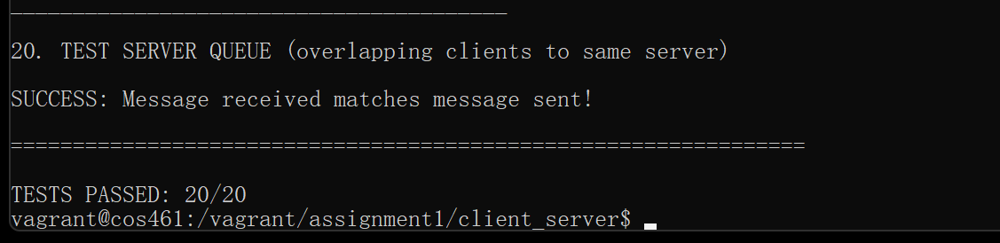

## <p align="center">华东师范大学数据科学与工程学院实践报告</p>

| **课程名称**：  计算机网络     | **年级**：  2022级 | **上机实践成绩**：             |
| ------------------------------ | ------------------ | ------------------------------ |
| **指导教师**：  赵明昊         | **姓名**： 田亦海  | **学号**：  10225101529        |
| **上机实践名称**：  Socket编程 |                    | **上机实践日期**：  2023/10/4  |
| **上机实践编号**：             | **组号**：         | **上机实践时间**：  12:34 a.m. |

---


### Ⅰ.实验任务

基本 socket 编程入门，编写两对 TCP 客户端和服务器程序，用于通过 Internet 发送和 接收文本消息。 一对客户端/服务器必须用 C 语言编写。另一对可以用 Python 或 Go 编写。 


### Ⅱ.使用环境

 使用Vagrant配置的虚拟机


### Ⅲ.实验过程

#### 1. 代码解释

##### C

```c
int client(char *server_ip, char *server_port)
{
    int sockfd = socket(AF_INET, SOCK_STREAM, 0); //创建一个绑定到流传输的套接字
    if (sockfd < 0)//错误处理
    {
        fprintf(stderr, "create socket error");
        return -1;
    }

    struct sockaddr_in server_addr;  //初始化套接字地址等信息
    memset(&server_addr, 0, sizeof(server_addr));
    server_addr.sin_family = AF_INET;
    server_addr.sin_addr.s_addr = inet_addr(server_ip);
    server_addr.sin_port = htons(atoi(server_port));

    int connectfd = connect(sockfd, (struct sockaddr *)&server_addr, sizeof(struct sockaddr)); //尝试连接
    if (connectfd < 0)//错误处理
    {
        fprintf(stderr, "connect server error");
        return -1;
    }

    char buf[SEND_BUFFER_SIZE + 5];//从stdin读入消息的缓冲区
    memset(buf, 0, SEND_BUFFER_SIZE + 5);

    while (!feof(stdin))//如果stdin未读入完毕
    {
        memset(buf, 0, SEND_BUFFER_SIZE + 5);
        int need_len=fread(buf, 1,SEND_BUFFER_SIZE, stdin);
        //读取最大SEND_BUFFER_SIZE大小的字节到buf，返回实际读取的字节数到need_len，这就是需要发送的字节数
        int this_len;//此次发送的实际发送字节数
        int sum_len = 0;//已经发送的字节数
        while (sum_len != need_len)//如果未发送完
        {
            this_len = send(sockfd, buf + sum_len, need_len - sum_len, MSG_NOSIGNAL);
            //MSG_NOSIGNAL可以避免因为服务器意外断开而发送失败导致的直接退出
            //buf + sum_len尝试从第一个未发送的字节继续发送
            //this_len存储本次发送的实际发送字节
            if (this_len == -1)//如果发送失败，进行错误处理
            {
                fprintf(stderr, "connect error");
                return -1;
            }
            sum_len += this_len;
        }
    }

    close(sockfd);//关闭连接
    return 0;
}
```

```c
int server(char *server_port)
{
    int sockfd, new_fd;
    if ((sockfd = socket(AF_INET, SOCK_STREAM, 0)) < 0)//创建一个绑定到流传输的套接字并错误处理
    {
        fprintf(stderr, "socket falied");
        return -1;
    }

    struct sockaddr_in server_addr;//初始化地址等信息
    memset(&server_addr, 0, sizeof(server_addr));
    server_addr.sin_family = AF_INET;
    server_addr.sin_port = htons(atoi(server_port));
    server_addr.sin_addr.s_addr = inet_addr("127.0.0.1");

    if (bind(sockfd, (struct sockaddr *)&server_addr, sizeof(server_addr)) < 0)//尝试绑定到端口，并错误处理
    {
        fprintf(stderr, "bind error");
        return -1;
    }

    if (listen(sockfd, QUEUE_LENGTH) < 0)//尝试开始监听，并错误处理
    {
        fprintf(stderr, "listen falied");
        return -1;
    }

    char recv_msg[RECV_BUFFER_SIZE + 5];//接受的消息的缓冲区
    int client_len = sizeof(struct sockaddr_in);
    while (1)//循环等待下一个客户端
    {
        fflush(stdout);//刷新输出缓冲区
        new_fd = accept(sockfd, (struct sockaddr *)&server_addr, &client_len); //accept来自客户端的连接请求
        if (new_fd == -1)//错误处理
            fprintf(stderr, "accept falied");
        else
        {
            while (1)//持续接受信息
            {
                memset(recv_msg, 0, RECV_BUFFER_SIZE + 5);
                int cnt=recv(new_fd, recv_msg, RECV_BUFFER_SIZE, 0);
                //接受最大RECV_BUFFER_SIZE字节的信息，实际接受字节数存储于cnt
                if (cnt == 0)//如果已经接受完全，则break；
                    break;
                fwrite(recv_msg, 1, cnt, stdout);//向stdout写入cnt字节的数据
            }
        }
        close(new_fd);//关闭连接
    }
    close(sockfd);//关闭连接
    return 0;
}
```


##### Python

```python
def client(server_ip, server_port):
    """TODO: Open socket and send message from sys.stdin"""
    
    cli = socket.socket()  #申请一个socket对象
    cli.connect((server_ip, server_port)) #尝试连接
    s = sys.stdin.buffer.read(SEND_BUFFER_SIZE) #从stdin读取最大SEND_BUFFER_SIZE的二进制数据
    #（python的socket只能发送二进制流数据，因此可以直接以二进制读取）
    while s: #若读取内容非空（即还未读取结束）
        cli.sendall(s) #全部发送读取的内容
        s = sys.stdin.buffer.read(SEND_BUFFER_SIZE) #继续从stdin读取最大SEND_BUFFER_SIZE的二进制流
    cli.close() #关闭连接
```

```py
def server(server_port):
    """TODO: Listen on socket and print received message to sys.stdout"""

    ser = socket.socket() #申请一个socket对象
    ser.bind(("localhost", server_port)) #绑定到端口
    ser.listen(QUEUE_LENGTH) #开始监听
    while (1):
        conn, addr = ser.accept() #接受来自客户端的连接
        # print(conn,addr)
        while (1):
            data = conn.recv(RECV_BUFFER_SIZE) #recv数据
            if not data: #如果数据读取为空（即已经读完了），则退出
                break
            sys.stdout.buffer.write(data) #向stdout写入二进制数据
            sys.stdout.buffer.flush() #刷新stdout缓冲区
    ser.close() #关闭socket连接
```


#### 2. 问题解决

##### （1） 服务器以及客户端读入数据输出数据的方式

比如对C客户端来说，此段代码：

我的第一个版本是用`fgets()`从stdin读取数据。这样无法通过随机长二进制消息的测试样例。

如果随机出`00000000`的二进制串，即`'\0'`，那么`fgets()`会判定为字符串结束符，可能无法进行后续的读取，`strlen()`也无法正确判断数据的大小。

选用`fread`读取数据，就可以避免此问题 , `fread`的返回值是读取的字节数，也很方便我们后续的处理。

相应的，使用`feof(stdin)`判断是否已经读取完毕

同理。对于C服务端，应该使用`fwrite`输出。


对于python代码，同样在读取与输出上存在问题。如果代码这样写：

```python
s = sys.stdin.read(SEND_BUFFER_SIZE)
cli.sendall(s)
```

会报错`'str' does not support the buffer interface`

是因为python读取的为字符串类型，socket发送的为二进制类型，需要进行类型转换。

经查阅，直接使用`s = sys.stdin.buffer.read(SEND_BUFFER_SIZE)`可以很方便的读取为二进制文件，无需额外的类型转换。

对应的，使用`sys.stdout.buffer.write(data)`进行输出。


##### （2） C版`sendall`的实现

```c
	int need_len = fread(buf, 1,SEND_BUFFER_SIZE, stdin);
	//读取最大SEND_BUFFER_SIZE大小的字节到buf，返回实际读取的字节数到need_len，这就是需要发送的字节数
    int this_len;
	//此次发送的实际发送字节数
    int sum_len = 0;   
	//已发送的字节数

    while (sum_len != need_len)//如果未发送完
    {      
        this_len = send(sockfd, buf + sum_len, need_len - sum_len, MSG_NOSIGNAL);
        //尝试从未发送的内容发送，并保存实际发送的字节数于this_len
        if (this_len == -1)
        {
            fprintf(stderr, "connect error");
            return -1;
        }
        sum_len += this_len;//计入已经发送的字节
    }
```

很合理。


#### 3. 运行结果



### Ⅳ.总结

掌握了C以及python下使用socket的基本操作，并编写可以正确运行的程序

练习了一些不常用的输入输出操作