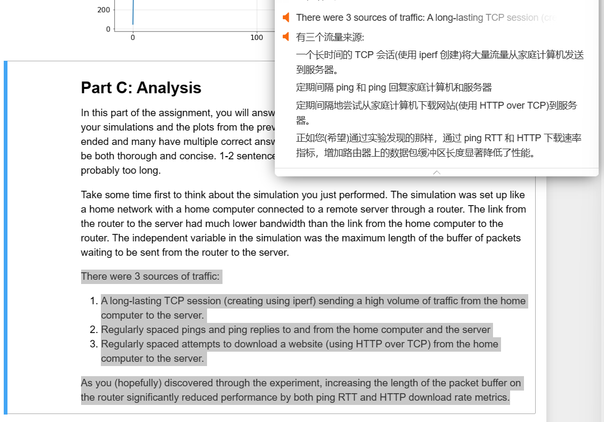
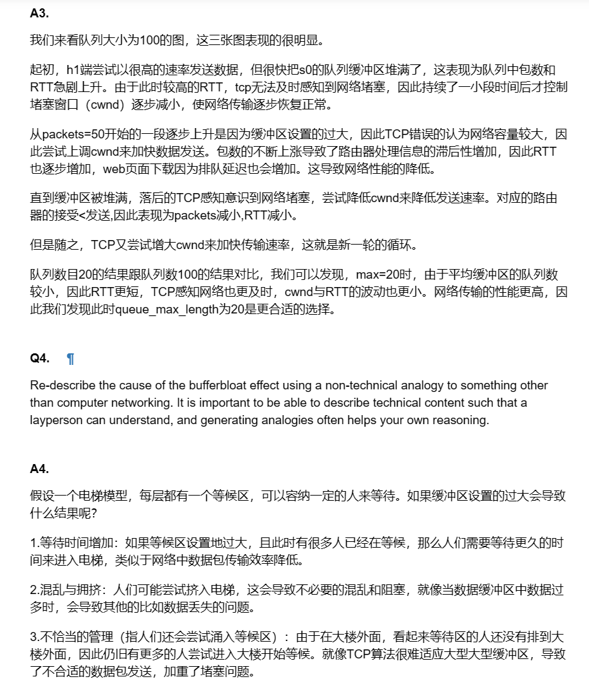

## 
华东师范大学数据科学与工程学院实践报告

| **课程名称**：  计算机网络                 | **年级**：  2022级 | **上机实践成绩**：             |
| ------------------------------------------ | ------------------ | ------------------------------ |
| **指导教师**：  赵明昊                     | **姓名**： 田亦海  | **学号**：  10225101529        |
| **上机实践名称**： TCP拥塞控制和缓冲区膨胀 |                    | **上机实践日期**：  2023/10/28 |
| **上机实践编号**：                         | **组号**：         | **上机实践时间**：  12:34 a.m. |

---

### Ⅰ.实验任务

创建自己的网络模拟，测试不同的缓冲区最大队列长度，完成代码，绘图，分析结果

### Ⅱ.使用环境

 使用Vagrant配置的虚拟机中运行jupyter notebook,主机浏览器上进行实验。

### Ⅲ.实验过程

#### 1）填写代码

这部分其实并不太难，虽然是未接触过的一套体系，但简单查阅文档并推敲代码意思即可填写出来。代码量很小，而且有许多提示。主要需要查阅一些函数的用法，以及写最后那个调用的时候注意变量名称即可。

主要发生的错误是意外写出了什么bug，可以在下一阶段的绘图运行时找到错误发生点，仔细阅读代码可以很方便debug。

#### 2）画图

调用一次函数即可，看清楚传参为你的自定义的名称的列表.

#### 3）分析

这里有一个让我有些疑惑的点，就是似乎我们的代码中没有保存关于http下载的信息，这里却让我们观察http下载速率指标。（当然可能是我写漏了）

在分析阶段，重点应该是Q3Q4，需要我们结合图例与知识，阐述缓冲区膨胀效应的原理。这部分我经过了一些网上资料的查找（比如CSDN）与思考，加深了对TCP控制流量方法以及缓冲区膨胀的理解。

电梯模型我觉得还是很贴切地描述了缓冲区膨胀效益。

### Ⅳ.总结

#### 收获：

对TCP拥塞控制的方法，以及缓冲区膨胀效应的理解程度大大加深了

对mininet等的python代码方法有了较初步的认识

查阅资料时稍微拓展了一些知识，比如CDN和AQM